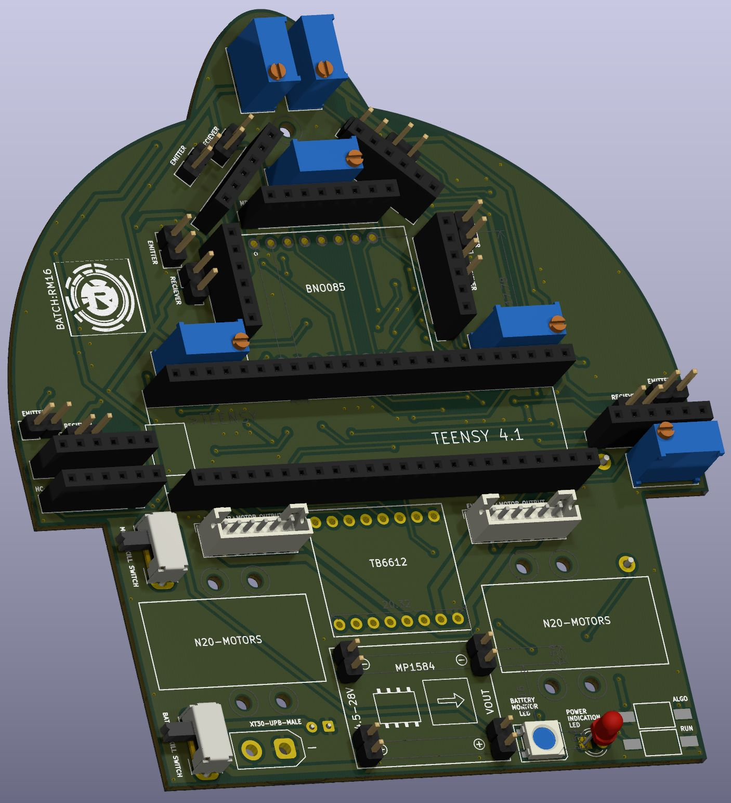
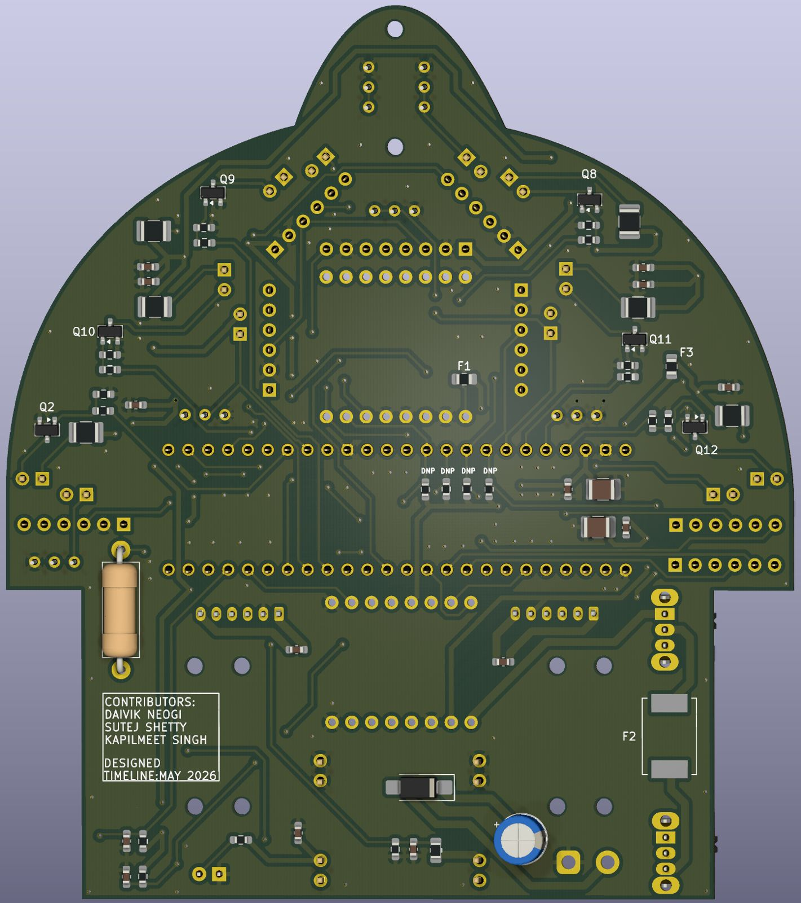

## 🤖 About the Bot

<table>
  <tr>
    <td>
      
       
      <em>PCB Maze Solver Robot Front</em>
    </td>
    <td>
      
       
      <em>PCB Maze Solver Robot Back</em>
    </td>
  </tr>
</table>

This is the first of the two almost identical bots we made for the Technoxian 2026 competition. 
It uses an array of **6 IR sensors** situated on the boundary of the maze solver. The orientation of the IR sensors is positioned such that we have maximum area coverage. 

For navigation and drive, we used a **BNO085 IMU** for precise point turns at every junction, **N20 DC motors** for the wheels, and a **TB6612FNG** motor driver. A **Teensy 4.1 MCU** acts as the brain for the bot, controlling all hardware components and the onboard software. A custom in-house 3D printed PLA casing was used to secure the battery.

**Detailed insights on the hardware can be found in the link below:**  
[🔗 Link to Elec Repo](Insert_Elec_Repo_Link_Here)

---

## 💻 Software Details

The bot's software is divided into 4 different files (plus one main file for running them together). Each file provides a different layer of abstraction so that dealing with complex hardware logic is not necessary when designing high-level maze-solving algorithms, keeping the code clean and readable.

### `one.h` and `one.cpp` (Hardware Abstraction Layer)
These files provide the first layer of abstraction and directly interact with the bot's hardware.

**Hardware Initialization**
*   `void initHardware()`: Called when the bot is switched on to initialize all onboard hardware. 
    *   Initializes the `Wire1` I2C bus at a 400kHz fast clock speed for near-instantaneous IMU readings.
    *   Starts the `Serial1` and `Serial2` (Bluetooth) monitors for wired and remote debugging.
    *   Configures all GPIO pins for the motor driver (PWM and INPUT), encoders (PULLUP), IR emitters (OUTPUT), and IR receivers (INPUT).
    *   Attaches hardware interrupts for push buttons and encoders.
    *   Initializes the BNO085 IMU and its game rotation vector report at a 400Hz refresh rate (2500µs).

**Odometry and Orientation Measurement**
*   `void isrLeftEncoder()` & `void isrRightEncoder()`: Interrupt Service Routines (ISRs) triggered by a state change on Phase A of the built-in hall effect encoders. The relative change between Phase A and Phase B is used to determine rotational direction and track distance traveled.
*   `float getYaw(uint16_t timeoutMs)`: Gets the latest `SH2_GAME_ROTATION_VECTOR` report. It extracts the quaternion (`qr, qi, qj, qk`) and converts it to a standard Euler Yaw angle. Features a non-blocking timeout failsafe to prevent main loop lockups if the IMU stalls.

**IR Sensor Functions**
*   `float getCorrectedReading(int sensorNum)`: Performs ambient light subtraction. It reads the analog value with the emitter OFF, turns it ON (waiting to stabilize via `settleMicros(1000)`), reads again, and returns `(active - ambient)`.
*   `float getCorrectedReadingAvg(int sensorNum)`: Exclusively used for tuning. Calls `getCorrectedReading` 5 consecutive times and returns the average to help tune detection and centering thresholds.

**Miscellaneous Functions**
*   `static inline void settleMicros(uint32_t us)`: A non-blocking microsecond delay function used before and after triggering IR sensors to stabilize phototransistors and ADCs.
*   `void runModeInterrupt()`: An ISR triggered on the falling edge of the "Run Mode" push button. Increments `runmodeButtonPressCount` to start a specific algorithm.
*   `void algoInterrupt()`: An ISR triggered on the falling edge of the "Algo" push button. Cycles `algoButtonPressCount` through 0, 1, and 2 (corresponding to Floodfill, Left Wall Follow, and Right Wall Follow).

---

### `two.h` and `two.cpp` (High-Level Control API)
These files provide the second layer of abstraction, containing high-level functions that directly utilize the hardware layer.

**Motor Control API**
*   `void motor1Forward(int speed)` & `void motor2Forward(int speed)`: Drives the specified motor (1 = Left, 2 = Right) forward at the given PWM speed (0-255).
*   `void motor1Reverse(int speed)` & `void motor2Reverse(int speed)`: Drives the specified motor in reverse at the given PWM speed (0-255).
*   `void motorStop()`: Stops the motors using a two-phase sequence: first setting `IN1` and `IN2` HIGH for 150ms to hard-brake and prevent drift, then pulling both to LOW for standby.

**Wall Detection API**
*   `bool isWallLeft()` & `bool isWallRight()`: Checks corrected side IR readings against `LEFT_WALL_THRESHOLD` and `RIGHT_WALL_THRESHOLD`.
*   `bool isWallFront()`: Checks both front IR sensors against `FRONT_WALL_DETECTION_THRESHOLD` and `FRONT2_WALL_DETECTION_THRESHOLD`. Returns true only if *both* exceed the threshold.
*   `bool isWallFrontCollision()`: Similar to `isWallFront` but uses much higher collision thresholds. This allows walls to be detected much later, acting as an interrupt to break out of movement functions when a crash is imminent.

**Bot Movement API**
*   `void turn(float angleDeg)`: Takes a target float angle and executes a turn using IMU readings and PID control.
*   `void centerUntilDistance(float dist)`: Main forward movement function. Tracks distance via N20 encoder ticks and continuously calls the PID controller (`applyPIDCentering`).
*   `void centerUntilWall()`: Identical to `centerUntilDistance()`, but drives indefinitely until a front wall is detected.

**PID & Setpoints**
*   **Setpoints:** `LEFT_SETPOINT` and `RIGHT_SETPOINT` represent IR readings when perfectly centered in a lane. `LEFT_MAX` and `RIGHT_MAX` represent physical wall contact.
*   `void applyPIDCentering(int rawLeft, int rawRight)`: Takes raw readings and calculates errors based on setpoints. Readings are linearly mapped between 50 (setpoint) and 100 (max wall contact) to compute precise steering adjustments.
